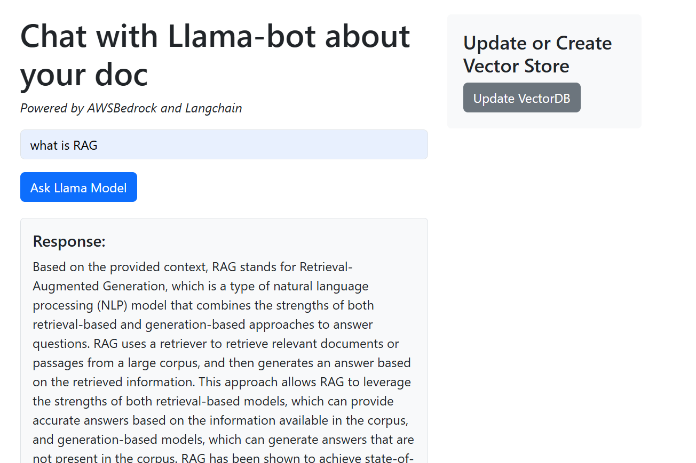

# 🚀 LLMOps RAG AWS Application

A **Retrieval-Augmented Generation (RAG)** powered Question Answering system, built using **Flask** and deployed with **end-to-end MLOps best practices**. This project demonstrates how to productionize an LLM-powered application using **Docker**, **AWS**, and **GitHub Actions**.

---

## 📌 Key Features

- ✅ RAG-based architecture (data ingestion + retrieval + generation)
- ✅ Modular and production-ready Python project structure
- ✅ Built with Flask for lightweight deployment
- ✅ Dockerized for portability and cloud deployment
- ✅ CI/CD pipeline with GitHub Actions
- ✅ Deployed to AWS App Runner via ECR
- ✅ Secure credentials and secrets management

---

## 🛠️ Tech Stack

| Tool / Service     | Purpose                        |
|--------------------|--------------------------------|
| Python 3.10        | Core programming language      |
| Flask              | Web framework for serving API  |
| Docker             | Containerization               |
| GitHub Actions     | CI/CD pipeline                 |
| AWS IAM, S3, ECR   | Access, storage, container registry |
| AWS App Runner     | Cloud deployment service       |

---
UI Image: 
---

## 📁 Project Structure

LLMOps-RAG-AWS-Application/
├── app.py                         # Flask app entry point
├── requirements.txt               # Python dependencies
├── Dockerfile                     # Docker build instructions
├── .dockerignore                  # Docker ignore rules
├── .gitignore                     # Git ignore rules
├── README.md                      # Project documentation
├── setup.py                       # (Optional) For packaging if needed
│
├── QASystem/
│   ├── __init__.py                # Makes QASystem a package
│   ├── ingestion.py               # Data ingestion logic
│   └── retrievalandgeneration.py # RAG pipeline (retrieval + generation)
│
├── venv/                          # Virtual environment (ignored)
│
└── .github/
    └── workflows/
        └── main.yaml              # GitHub Actions CI/CD pipeline


---

## ⚙️ Setup Instructions

### 1. Clone the Repository

```bash
git clone https://github.com/Aadarsh1132/LLMOps-RAG-AWS-Application.git
cd LLMOps-RAG-AWS-Application

### 2. Create & Activate Virtual Environment

python -m venv venv
venv\Scripts\activate  # On Windows
# OR
source venv/bin/activate  # On macOS/Linux

pip install -r requirements.txt
✅ Add venv/ to .gitignore

### 3. Configure AWS CLI
Create an IAM user with AdministratorAccess
Generate access keys
Run:
aws configure
# Enter access key, secret key, region, output format

### 4. Run the Flask App Locally
python app.py

### 5. Build & Run Docker Locally
docker build -t ragproj1-app .
docker run -p 8501:8501 ragproj1-app

### 6. Setup CI/CD via GitHub Actions
Add the following secrets to your GitHub repository:

AWS_ACCESS_KEY_ID
AWS_SECRET_ACCESS_KEY
AWS_DEFAULT_REGION
AWS_ECR_REPO_URI

Commit and push your code to GitHub.

The CI/CD pipeline will automatically:
  Build Docker image
  Push it to AWS ECR

### 7. Deploy via AWS App Runner
  Go to AWS App Runner
  Choose Amazon ECR as source
  Paste or browse the ECR URI
  Select: 2 vCPU / 6GB RAM
  Set port: 8501(Same as docker port)
  Keep default settings and deploy
  
  ✅ After a few minutes, your app will be live with a public URL.
